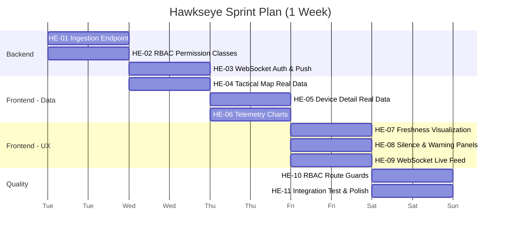
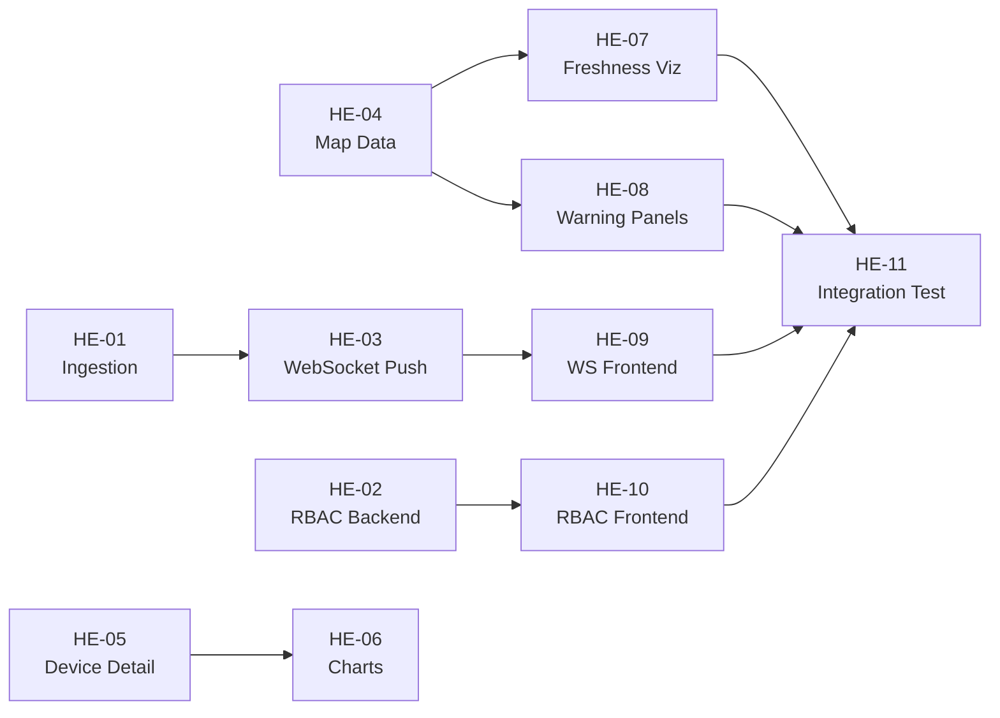

# Hawkseye — Developer Tickets (1-Week Sprint)

**Sprint**: Revision Sprint — Wire Up Real Data  
**Duration**: 5 working days (2026-02-17 → 2026-02-21)  
**Goal**: Remove all dummy data, wire every page to real APIs, implement visual freshness indicators, add basic security enforcement.

---

## Sprint Overview



---

## Day 1 (Monday) — Backend Foundation

---

### HE-01: Telemetry Ingestion Endpoint

**Priority**: 🔴 Critical  
**Estimate**: 4 hours  
**Assignee**: Backend Dev

#### Description
Create `POST /api/v1/ingest/` — the entry point for real device data from Iridium ground station.

#### Acceptance Criteria
- [ ] Accepts POST with binary SBD payload
- [ ] Validates API key in `Authorization` header
- [ ] Checks IMEI exists in `AssetComms` table → 403 if unknown
- [ ] Checks `cdr_reference` is unique → 409 if duplicate
- [ ] Checks `device_time` within ±48 hours → 422 if stale
- [ ] Decodes binary payload into structured Telemetry fields
- [ ] Creates `RawPacket` + `Telemetry` records
- [ ] Signal handler auto-updates `AssetState`
- [ ] Returns 201 with created telemetry ID

#### Files to Modify
| File | Action |
|------|--------|
| `apps/operations/api_views.py` | Add `IngestView` |
| `apps/operations/serializers.py` | Add `IngestSerializer` |
| `apps/operations/urls.py` | Add `POST /api/v1/ingest/` route |
| `apps/operations/decoder.py` | **NEW** — Binary SBD decoder |

#### Notes
- For dev/testing, also accept JSON payload with pre-decoded fields
- Reference the Iridium SBD DirectIP spec for binary format
- Log every ingestion attempt in `AuditLog`

---

### HE-02: RBAC Permission Classes

**Priority**: 🔴 Critical  
**Estimate**: 3 hours  
**Assignee**: Backend Dev

#### Description
Create DRF permission classes and apply them to all V1 API endpoints.

#### Acceptance Criteria
- [ ] `permissions.py` with classes: `IsObserver`, `IsFieldOperator`, `IsAnalyst`, `IsMissionCommander`, `IsAdmin`
- [ ] `ReadOnlyTelemetry` permission — blocks POST/PUT/DELETE on telemetry for non-admin roles
- [ ] `CommandCenterScoped` mixin — filters querysets to user's assigned command center(s)
- [ ] All 8 existing API views protected with appropriate permission classes
- [ ] Unauthenticated requests return 401
- [ ] Wrong-role requests return 403
- [ ] Unit tests for each permission class

#### Files to Modify
| File | Action |
|------|--------|
| `apps/operations/permissions.py` | **NEW** — Permission classes |
| `apps/operations/api_views.py` | Add `permission_classes` to all views |
| `apps/operations/mixins.py` | **NEW** — `CommandCenterScopedMixin` |

---

## Day 2 (Tuesday) — Backend WebSocket + Frontend Map

---

### HE-03: WebSocket Authentication & Live Push

**Priority**: 🟡 High  
**Estimate**: 4 hours  
**Assignee**: Backend Dev

#### Description
Wire up Django Channels WebSocket consumer for authenticated real-time telemetry push.

#### Acceptance Criteria
- [ ] `TelemetryConsumer` in `consumers.py` authenticates JWT on connect
- [ ] Rejects unauthenticated connections
- [ ] Subscribes user to their command center's telemetry channel
- [ ] On new `Telemetry` save, broadcasts to relevant channel group
- [ ] Message format: `{ type: "telemetry.update", asset_id, lat, lon, freshness, battery, timestamp }`
- [ ] Channel layer configured with Redis backend
- [ ] ASGI routing in `core/asgi.py`

#### Files to Modify
| File | Action |
|------|--------|
| `apps/operations/consumers.py` | **NEW** or update existing |
| `apps/operations/routing.py` | **NEW** — WebSocket URL routing |
| `core/asgi.py` | Add Channels routing |
| `apps/operations/signals.py` | Add WS broadcast on Telemetry save |
| `core/settings.py` | Configure CHANNEL_LAYERS with Redis |

---

### HE-04: Tactical Map — Wire to Real Data

**Priority**: 🔴 Critical  
**Estimate**: 4 hours  
**Assignee**: Frontend Dev

#### Description
Connect the Leaflet tactical map component to real asset data from the API. Markers should appear at actual GPS positions.

#### Acceptance Criteria
- [ ] Map fetches from `assetService.getAssetStates()`
- [ ] One marker per asset at `(last_lat, last_lon)` position
- [ ] Marker popup shows: callsign, IMEI, freshness, battery, last seen
- [ ] Map auto-centers on asset cluster bounds
- [ ] Empty state: "No assets with position data" message
- [ ] Loading state: spinner while fetching
- [ ] Error state: banner with retry button

#### Files to Modify
| File | Action |
|------|--------|
| `components/dashboard/TacticalMap.jsx` | Update to use real data |
| `pages/auth/dashboard.jsx` | Pass real data to TacticalMap |

#### Dependencies
- `assetService.getAssetStates()` must return `last_lat`, `last_lon`

---

## Day 3 (Wednesday) — Device Detail + Charts

---

### HE-05: Device Detail Page — Real Data

**Priority**: 🟡 High  
**Estimate**: 3 hours  
**Assignee**: Frontend Dev

#### Description
Wire the single device detail page (`device.tsx`) to real API data.

#### Acceptance Criteria
- [ ] Fetches asset state from `assetService.getAssetState(id)`
- [ ] Fetches telemetry history from `assetService.getTelemetry(id)`
- [ ] Shows: callsign, IMEI, description, species, product
- [ ] Shows: current position on mini-map
- [ ] Shows: freshness badge, confidence score, battery level
- [ ] Shows: telemetry track on map (polyline from history)
- [ ] Loading / error states

#### Files to Modify
| File | Action |
|------|--------|
| `pages/core/device.tsx` | Replace mock data with API calls |
| `api.js` | Already has `getAssetState()` and `getTelemetry()` |

---

### HE-06: Telemetry History Charts

**Priority**: 🟡 High  
**Estimate**: 3 hours  
**Assignee**: Frontend Dev

#### Description
Add time-series charts to the device detail page showing historical sensor data.

#### Acceptance Criteria
- [ ] Battery voltage over time (line chart)
- [ ] Speed over time (line chart)
- [ ] Temperature over time (line chart)
- [ ] Activity level over time (bar chart)
- [ ] Time range selector (last 24h, 7d, 30d)
- [ ] Charts use `recharts` or `Chart.js`
- [ ] Responsive — work on mobile

#### Files to Modify
| File | Action |
|------|--------|
| `pages/core/device.tsx` | Add chart section |
| `components/charts/TelemetryChart.jsx` | **NEW** — Reusable chart component |
| `api.js` | Already has `getTelemetry()` with `limit` param |

---

## Day 4 (Thursday) — Visual UX + WebSocket

---

### HE-07: Map Marker Freshness Visualization

**Priority**: 🔴 Critical  
**Estimate**: 3 hours  
**Assignee**: Frontend Dev

#### Description
Make data age **visually obvious** on the map. This is a core product differentiator.

#### Acceptance Criteria
- [ ] `live` assets: solid green marker with subtle pulse animation
- [ ] `recent` assets: solid blue marker, static
- [ ] `stale` assets: faded marker (50% opacity), yellow tint
- [ ] `silent` assets: dimmed marker with warning icon overlay
- [ ] Confidence affects marker opacity (0.4–1.0 range)
- [ ] Legend panel showing marker states
- [ ] Tooltip shows "Last contact: X ago" in human-readable format

#### Visual Reference

```
🟢 Solid + Pulse  = LIVE    (<5 min)     "Tracking"
🔵 Solid           = RECENT  (<1 hr)      "Online"
🟡 Faded            = STALE   (<24 hr)     "Last seen X hrs ago"
⚪ Dimmed + ⚠️      = SILENT  (>24 hr)     "NO CONTACT"
```

#### Files to Modify
| File | Action |
|------|--------|
| `components/dashboard/TacticalMap.jsx` | Add marker styling logic |
| `index.css` or component CSS | Pulse animation keyframes |

---

### HE-08: Silence & Warning Panels

**Priority**: 🔴 Critical  
**Estimate**: 2 hours  
**Assignee**: Frontend Dev

#### Description
Add prominent warning banners when assets are silent or in critical state.

#### Acceptance Criteria
- [ ] Dashboard header shows: "{N} ASSETS OFFLINE" banner (red/amber) when any asset has `freshness=silent`
- [ ] Asset table shows ⚠️ icon next to silent assets
- [ ] Battery < 3.2V shows "LOW BATTERY" indicator
- [ ] Clicking warning navigates to filtered view of affected assets
- [ ] Warning sounds optional (configurable, off by default)

#### Files to Modify
| File | Action |
|------|--------|
| `pages/auth/dashboard.jsx` | Add warning banner component |
| `components/dashboard/WarningPanel.jsx` | **NEW** — Warning banner |
| `pages/core/devices.jsx` | Add warning icons to table rows |

---

### HE-09: WebSocket Live Feed (Frontend)

**Priority**: 🟡 High  
**Estimate**: 3 hours  
**Assignee**: Frontend Dev

#### Description
Connect the dashboard to the WebSocket consumer for real-time updates without polling.

#### Acceptance Criteria
- [ ] `useWebSocket` hook connects to `ws://localhost:8000/ws/telemetry/`
- [ ] Sends JWT token on connect
- [ ] On `telemetry.update` message, updates relevant AssetState in local state
- [ ] Map marker position updates without full page reload
- [ ] Reconnect logic with exponential backoff (1s, 2s, 4s, 8s, max 30s)
- [ ] Visual indicator showing WebSocket connection status (green dot / red dot)
- [ ] Falls back to 30s polling if WebSocket fails

#### Files to Modify
| File | Action |
|------|--------|
| `hooks/useWebSocket.js` | **NEW** — WebSocket hook |
| `pages/auth/dashboard.jsx` | Integrate WebSocket hook |
| `api.js` | Add WebSocket URL configuration |

---

## Day 5 (Friday) — Quality & Guards

---

### HE-10: Frontend RBAC Route Guards

**Priority**: 🟡 High  
**Estimate**: 3 hours  
**Assignee**: Frontend Dev

#### Description
Protect frontend routes based on user role.

#### Acceptance Criteria
- [ ] `RoleGuard` component wraps protected routes
- [ ] Fetches user role from `userService.getMyRoles()`
- [ ] Redirects to `/unauthorized` if role doesn't match
- [ ] Role-specific navigation: hide menu items user can't access
- [ ] Dashboard route: all authenticated users
- [ ] Billing route: `MISSION_COMMANDER` and `ADMIN` only
- [ ] User management: `ADMIN` only

#### Files to Modify
| File | Action |
|------|--------|
| `components/auth/RoleGuard.jsx` | **NEW** — Route guard component |
| `pages/routes.jsx` | Wrap routes with RoleGuard |
| `components/layout/Header.jsx` | Conditionally show nav items |

---

### HE-11: Integration Test & Polish

**Priority**: 🟡 High  
**Estimate**: 4 hours  
**Assignee**: Full Stack

#### Description
End-to-end validation that everything works together with real data.

#### Acceptance Criteria
- [ ] Run `seed_operational_data` → all pages load without errors
- [ ] Dashboard shows correct asset counts from API
- [ ] Devices page shows real assets with freshness badges
- [ ] Map shows markers at real GPS positions
- [ ] Device detail page shows telemetry history
- [ ] Charts render with real data points
- [ ] Filter by command center works
- [ ] Filter by mission works
- [ ] Search by callsign/IMEI works
- [ ] `vite build` completes with 0 errors
- [ ] No console errors in browser
- [ ] Mobile responsive check (3 breakpoints)

#### Verification Commands
```bash
# Backend
cd backend/webapp
../venv_hawkseye/bin/python manage.py seed_operational_data
../venv_hawkseye/bin/python manage.py runserver 0.0.0.0:8000

# Frontend
cd frontend
npm run dev

# Build check
npm run build
```

---

## Summary Table

| ID | Ticket | Priority | Day | Est. Hours | Type |
|----|--------|----------|-----|-----------|------|
| HE-01 | Ingestion Endpoint | 🔴 Critical | Mon | 4h | Backend |
| HE-02 | RBAC Permission Classes | 🔴 Critical | Mon | 3h | Backend |
| HE-03 | WebSocket Auth & Push | 🟡 High | Tue | 4h | Backend |
| HE-04 | Tactical Map Real Data | 🔴 Critical | Tue | 4h | Frontend |
| HE-05 | Device Detail Real Data | 🟡 High | Wed | 3h | Frontend |
| HE-06 | Telemetry Charts | 🟡 High | Wed | 3h | Frontend |
| HE-07 | Freshness Visualization | 🔴 Critical | Thu | 3h | Frontend |
| HE-08 | Silence & Warning Panels | 🔴 Critical | Thu | 2h | Frontend |
| HE-09 | WebSocket Live Feed | 🟡 High | Thu | 3h | Frontend |
| HE-10 | RBAC Route Guards | 🟡 High | Fri | 3h | Frontend |
| HE-11 | Integration Test & Polish | 🟡 High | Fri | 4h | QA |
| | **Total** | | **5 days** | **36h** | |

---

## Definition of Done

A ticket is **done** when:
1. Code is written and committed
2. No `console.error` in browser
3. `vite build` passes with 0 errors
4. Feature works with seeded data
5. Mobile responsive (tested at 375px, 768px, 1440px)

---

## Dependencies



---

*Last Updated: 2026-02-16*
