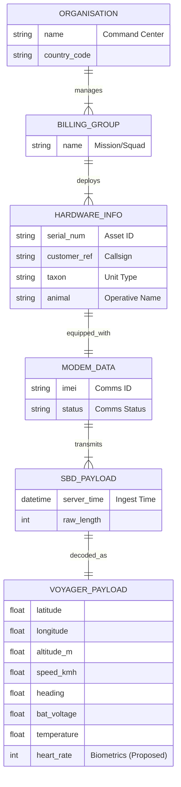

# Hawkseye Data Architecture & ERD Plan

## Project Overview
Hawkseye is a military-grade tactical monitoring platform. The data model is designed to support real-time telemetry ingestion, asset management, and mission-critical analytics.

## Core Entities (Proposed Naming)

### 1. Tactical Asset (Field Asset)
*   **Current Model**: `HardwareInfo` / `ModemData`
*   **Description**: Represents a physical unit in the field (e.g., soldier, vehicle, drone, sensor).
*   **Key Attributes**:
    *   `Asset ID` (UUID/Serial): Unique identifier (e.g., "Spectre-1").
    *   `Type`: Infantry, Vehicle, Drone, Stationary Sensor.
    *   `Status`: Active, Inactive, MIA, Maintenance.
    *   `Callsign`: Tactical designation.

### 2. Telemetry Packet (Metrics)
*   **Current Model**: `VoyagerPayload` / `SbdPayload`
*   **Description**: A single data point received from an asset.
*   **Key Attributes**:
    *   `Timestamp`: Precise time of data capture.
    *   `Coordinates`: Lat/Lon/Alt (GPS).
    *   `Vital Signs`: Heart rate, Body temp (for soldiers).
    *   `Diagnostics`: Battery, Fuel, Ammo count (if applicable).
    *   `Environment`: Temp, Pressure, Radiation levels.

### 3. Mission (Organization/Group)
*   **Current Model**: `Organisations` / `BillingGroups`
*   **Description**: A grouping of assets for a specific operation or theatre.
*   **Key Attributes**:
    *   `Mission Code`: Operation name.
    *   `Theater`: Location/Region.
    *   `Commander`: Point of contact.

## ERD Diagram (Mermaid)

## Recommendations for Tone & Language
*   **"Metrix" -> Telemetry**: Use "Telemetry" for raw data streams.
*   **"Device" -> Asset**: Refer to devices as "Assets" or "Units".
*   **"Group" -> Squad/Platoon**: Hierarchy should reflect military structure.
*   **"User" -> Commander/Operator**: System users are operators.

## Login Credentials
*   **Username**: See `.env` file
*   **Password**: See `.env` file
