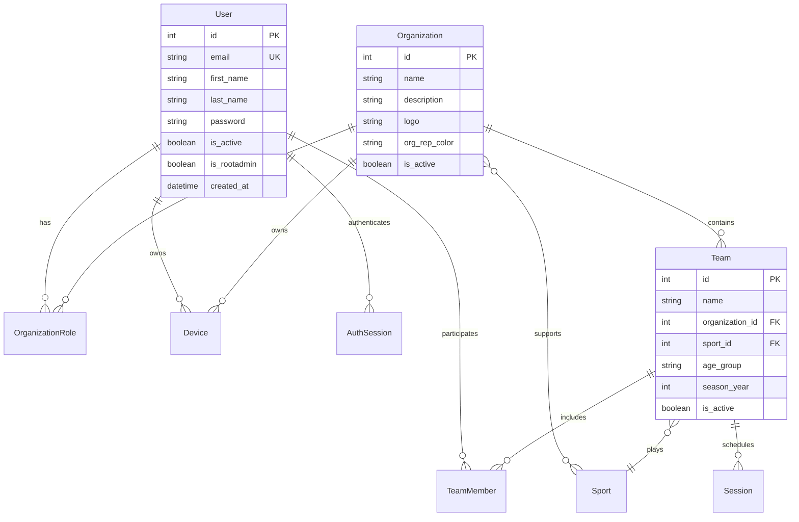
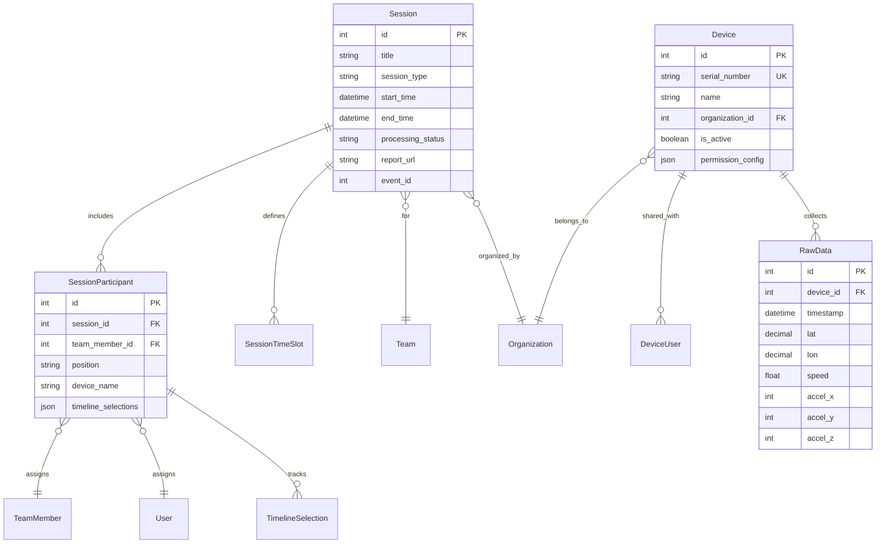
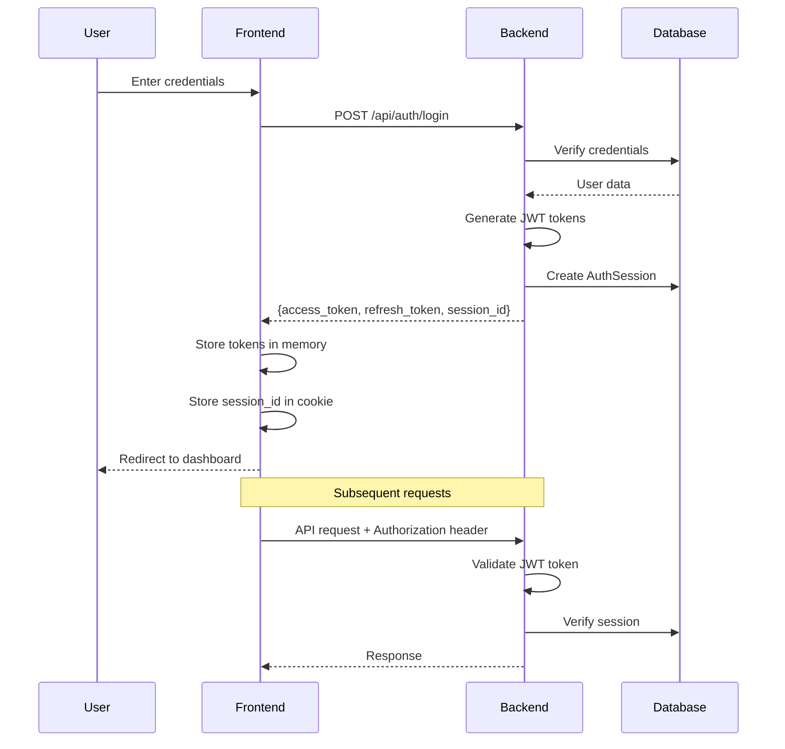
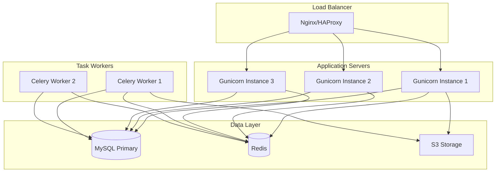

# Player1Sport Platform - System Architecture Documentation

## Executive Summary

Player1Sport is a comprehensive sports analytics platform that enables organizations, teams, and coaches to track athlete performance using GPS and accelerometer data from wearable devices. The platform provides real-time data collection, processing, visualization, and reporting capabilities for sports sessions (games, practices, training).

## Technology Stack

### Backend
- **Framework**: Django 5.x (Python)
- **Database**: MySQL 8.x (dual-database architecture)
- **API**: Django REST Framework
- **Task Queue**: Celery with Redis
- **Authentication**: Custom session-based auth with JWT tokens
- **Admin Interface**: Django Unfold
- **Cache**: Redis
- **Email**: SMTP with fallback to file storage

### Frontend
- **Framework**: React 18.x with TypeScript
- **Build Tool**: Vite 6.x
- **Routing**: React Router DOM v6
- **UI Libraries**: 
  - Material-UI (MUI)
  - Material Tailwind
  - Tailwind CSS
- **Charts**: Chart.js with react-chartjs-2
- **Forms**: React Hook Form with Zod validation
- **HTTP Client**: Axios
- **Internationalization**: i18next

### Infrastructure
- **Web Server**: Django development server (production: Gunicorn/uWSGI recommended)
- **Static Files**: WhiteNoise
- **File Storage**: Local filesystem (S3 recommended for production)
- **WebSocket**: Custom WebSocket server (Node.js)

## System Architecture

### High-Level Architecture

```mermaid
graph TB
    subgraph "Frontend Layer"
        A[React SPA<br/>Vite Dev Server<br/>Port 5173]
    end
    
    subgraph "Backend Layer"
        B[Django API<br/>Port 8000]
        C[Celery Workers]
        D[WebSocket Server<br/>Port 8080]
    end
    
    subgraph "Data Layer"
        E[(MySQL<br/>playerone_website<br/>Django Core)]
        F[(MySQL<br/>playerone_data<br/>Application Data)]
        G[(MySQL<br/>player1sport<br/>Legacy Data)]
        H[(Redis<br/>Cache & Queue)]
    end
    
    subgraph "External Services"
        I[SMTP Server]
        J[Ollama AI<br/>Report Generation]
    end
    
    A -->|REST API| B
    A -->|WebSocket| D
    B --> E
    B --> F
    B --> G
    B --> H
    C --> H
    C --> F
    C --> G
    B -->|Email| I
    C -->|AI Reports| J
    
    style A fill:#61dafb
    style B fill:#092e20
    style E fill:#4479a1
    style F fill:#4479a1
    style G fill:#4479a1
    style H fill:#dc382d
```



### Dual-Database Architecture

The system uses a **strict dual-database architecture** to separate concerns:

#### 1. **playerone_website** (Default Database)
- **Purpose**: Django core functionality
- **Tables**:
  - Django auth (auth_user, auth_group, auth_permission)
  - Django admin (django_admin_log)
  - Django sessions (django_session)
  - Django content types (django_content_type)
  - Django migrations (django_migrations)
  - Mailer app (mailer_emaillogger, mailer_emailtemplate)
  - Pages app (pages_contactmessage)

#### 2. **playerone_data** (Data Database)
- **Purpose**: Application-specific data
- **Tables** (30 total):
  - **Users**: users_users, users_user_types, users_auth_sessions, users_activation_tokens, users_invitations, users_notifications
  - **Organizations**: users_organizations, users_organization_roles, users_organizations_sports
  - **Sports**: users_sports, users_sport_time_slots, users_positions
  - **Teams**: users_teams, users_team_members, users_team_members_positions
  - **Sessions**: users_sessions, users_session_participants, users_session_time_slots
  - **Devices**: devices_devices, devices_device_users, devices_manufacturer_devices, devices_raw_data, users_device_assignments, users_device_activity_logs
  - **Surveys**: surveys_survey, surveys_surveyquestion, surveys_surveyresponse, surveys_surveytemplate, surveys_surveytemplatequestion

#### 3. **player1sport** (Legacy Database)
- **Purpose**: Legacy Player1 device data
- **Tables**: p1_dev_raw, p1_dev_processed, p1_dev_meta, p1_dev_summaries
- **Access**: Read-only via legacy_data app

### Database Routing Strategy

The system uses **StrictDatabaseRouter** to enforce database separation:

```python
# core/strict_db_router.py
class StrictDatabaseRouter:
    def db_for_read(self, model, **hints):
        if model._meta.app_label in ['users', 'devices', 'surveys', 'data_processing']:
            return 'data'
        return 'default'
    
    def db_for_write(self, model, **hints):
        if model._meta.app_label in ['users', 'devices', 'surveys', 'data_processing']:
            return 'data'
        return 'default'
```

## Core Domain Models

### User Management



### Session & Device Management



## Application Architecture

### Django Apps Structure

```
backend/webapp/apps/
├── users/              # User, Organization, Team, Session management
│   ├── models.py       # Core domain models
│   ├── views.py        # REST API endpoints
│   ├── serializers.py  # DRF serializers
│   └── permissions.py  # Custom permissions
├── devices/            # Device management and raw data
│   ├── models.py       # Device, ManufacturerDevice, RawData
│   ├── views.py        # Device API endpoints
│   └── validators.py   # Serial number validation
├── surveys/            # Survey and wellness tracking
│   ├── models.py       # Survey, SurveyTemplate, SurveyResponse
│   └── views.py        # Survey API endpoints
├── data_processing/    # Data analysis and report generation
│   ├── tasks.py        # Celery tasks for data processing
│   ├── reports.py      # PDF/HTML report generation
│   └── views.py        # Processing API endpoints
├── legacy_data/        # Legacy database access
│   ├── models.py       # LegacyRawData, LegacyMetaData
│   └── router.py       # Legacy database router
├── pages/              # Public pages (contact, about)
│   └── models.py       # ContactMessage
└── mailer/             # Email system
    ├── models.py       # EmailTemplate, EmailLogger
    └── services.py     # Email sending logic
```

### Frontend Architecture

```
frontend/src/
├── components/         # Reusable UI components
│   ├── common/        # Buttons, inputs, modals
│   ├── layout/        # Header, footer, navigation
│   └── forms/         # Form components
├── pages/             # Route pages
│   ├── auth/          # Login, register, password reset
│   ├── dashboard/     # Main dashboard
│   ├── teams/         # Team management
│   ├── sessions/      # Session creation and viewing
│   ├── devices/       # Device management
│   └── reports/       # Report viewing
├── services/          # API client services
│   ├── api.js         # Axios configuration
│   ├── auth.js        # Authentication API
│   ├── users.js       # User API
│   ├── teams.js       # Team API
│   └── sessions.js    # Session API
├── hooks/             # Custom React hooks
├── utils/             # Utility functions
└── contexts/          # React contexts (auth, theme)
```

## Authentication & Authorization

### Authentication Flow



### Permission System

The platform implements a **role-based access control (RBAC)** system:

#### Organization Roles
- **ROOT_ADMIN**: Platform administrator (full access)
- **ADMIN**: Organization administrator (billing, user management)
- **ORG_REP**: Organization representative (team management)
- **COACH**: Team coach (session management, player data)
- **PLAYER**: Athlete (view own data)

#### Permissions
- `can_manage_events`: Create/edit sessions
- `can_manage_teams`: Create/edit teams
- `can_manage_billing`: Access billing information
- `can_assign_devices`: Assign devices to users
- `can_invite_users`: Invite new users to organization

## Data Processing Pipeline

### Session Data Processing Flow

```mermaid
graph LR
    A[User Creates Session] --> B[Assign Devices to Players]
    B --> C[Session Occurs<br/>Devices Collect Data]
    C --> D[User Clicks<br/>'Process Report']
    D --> E[Celery Task Queued]
    E --> F[Ingest Raw Data<br/>from Devices]
    F --> G[Calculate Metrics<br/>Speed, Distance, Zones]
    G --> H[Fetch Survey Data]
    H --> I[Generate Plots<br/>Charts, GPS Maps]
    I --> J[Create HTML Report]
    J --> K[Convert to PDF]
    K --> L[Save Report URL]
    L --> M[Update Session Status]
    M --> N[User Views Report]
    
    style D fill:#ffd700
    style E fill:#ff6b6b
    style J fill:#51cf66
```



### Data Processing Components

1. **Player1 Data Library** (`player1/`)
   - `data_prep.py`: Data cleaning and metric calculation
   - `player_summary.py`: Individual player statistics
   - `team_summary.py`: Team-level aggregations
   - `plots.py`: Visualization generation

2. **Celery Tasks** (`apps/data_processing/tasks.py`)
   - `process_session_data(session_id)`: Main processing task
   - `generate_player_report(session_id, player_id)`: Individual reports
   - `generate_team_report(session_id)`: Team reports

3. **Report Generation** (`apps/data_processing/reports.py`)
   - HTML template rendering
   - PDF conversion (WeasyPrint)
   - Chart embedding (matplotlib)

## API Endpoints

### Authentication
- `POST /api/auth/login` - User login
- `POST /api/auth/logout` - User logout
- `POST /api/auth/refresh` - Refresh access token
- `POST /api/auth/register` - User registration
- `POST /api/auth/password-reset` - Password reset request

### Users
- `GET /api/users/me` - Get current user profile
- `PUT /api/users/me` - Update user profile
- `GET /api/users/{id}` - Get user by ID
- `POST /api/users/invite` - Invite new user

### Organizations
- `GET /api/organizations` - List organizations
- `POST /api/organizations` - Create organization
- `GET /api/organizations/{id}` - Get organization details
- `PUT /api/organizations/{id}` - Update organization

### Teams
- `GET /api/teams` - List teams
- `POST /api/teams` - Create team
- `GET /api/teams/{id}` - Get team details
- `PUT /api/teams/{id}` - Update team
- `POST /api/teams/{id}/members` - Add team member

### Sessions
- `GET /api/sessions` - List sessions
- `POST /api/sessions` - Create session
- `GET /api/sessions/{id}` - Get session details
- `PUT /api/sessions/{id}` - Update session
- `POST /api/sessions/{id}/process` - Trigger data processing
- `GET /api/sessions/{id}/status` - Get processing status
- `GET /api/sessions/{id}/report` - Download report

### Devices
- `GET /api/devices` - List devices
- `POST /api/devices` - Register device
- `GET /api/devices/{id}` - Get device details
- `POST /api/devices/{id}/assign` - Assign device to user
- `GET /api/devices/{id}/data` - Get raw data

## Security Considerations

### Authentication Security
- JWT tokens with short expiration (30 minutes)
- Refresh tokens with longer expiration (1 day)
- Session-based tracking for revocation
- CSRF protection enabled
- CORS configured for specific origins

### Data Security
- Password hashing with Django's PBKDF2
- SQL injection prevention via ORM
- XSS protection via React's escaping
- Input validation with Zod schemas
- File upload validation

### API Security
- Rate limiting (recommended: django-ratelimit)
- Permission checks on all endpoints
- Organization/team isolation
- Device ownership verification

## Performance Optimization

### Database Optimization
- Indexes on foreign keys and frequently queried fields
- Connection pooling (CONN_MAX_AGE=300)
- Query optimization with select_related/prefetch_related
- Database-level constraints

### Caching Strategy
- Redis cache for session data
- Cache timeout: 48 hours
- Cache invalidation on updates
- API response caching for read-heavy endpoints

### Frontend Optimization
- Code splitting with React.lazy
- Image optimization
- Lazy loading for lists
- Debounced search inputs

## Deployment Architecture

### Recommended Production Setup



## Environment Configuration

### Required Environment Variables

```bash
# Django Settings
DJANGO_SECRET_KEY=<secret-key>
DJANGO_DEBUG=False
DJANGO_ALLOWED_HOSTS=www.player1sport.com,player1sport.com

# Default Database (Django Core)
DB_ENGINE=django.db.backends.mysql
DB_NAME=playerone_website
DB_USER=<username>
DB_PASSWORD=<password>
DB_HOST=localhost
DB_PORT=3306

# Data Database (Application Data)
DATA_DB_ENGINE=django.db.backends.mysql
DATA_DB_NAME=playerone_data
DATA_DB_USER=<username>
DATA_DB_PASSWORD=<password>
DATA_DB_HOST=localhost
DATA_DB_PORT=3306

# Redis
REDIS_URL=redis://127.0.0.1:6379/7

# Email
EMAIL_HOST=<smtp-host>
EMAIL_PORT=587
EMAIL_HOST_USER=<email>
EMAIL_HOST_PASSWORD=<password>
EMAIL_USE_TLS=True

# Ollama (AI Report Generation)
OLLAMA_URL=http://localhost:11434/api/generate
```

## Monitoring & Logging

### Logging Configuration
- **Console**: All INFO+ messages
- **File**: `logs/debug.log` for all messages
- **Email**: ERROR+ messages to admins (production)

### Monitoring Recommendations
- Application monitoring: Sentry
- Performance monitoring: New Relic / DataDog
- Database monitoring: MySQL Enterprise Monitor
- Uptime monitoring: Pingdom / UptimeRobot

## Future Enhancements

1. **Real-time Data Streaming**: WebSocket integration for live session data
2. **Mobile App**: React Native app for coaches and players
3. **Advanced Analytics**: Machine learning for injury prediction
4. **Video Integration**: Sync video with GPS data
5. **Multi-sport Support**: Expand beyond current sports
6. **API v2**: GraphQL API for more flexible queries
7. **Microservices**: Split data processing into separate service

## References

- [Django Documentation](https://docs.djangoproject.com/)
- [React Documentation](https://react.dev/)
- [Django REST Framework](https://www.django-rest-framework.org/)
- [Celery Documentation](https://docs.celeryproject.org/)
- [MySQL Documentation](https://dev.mysql.com/doc/)
